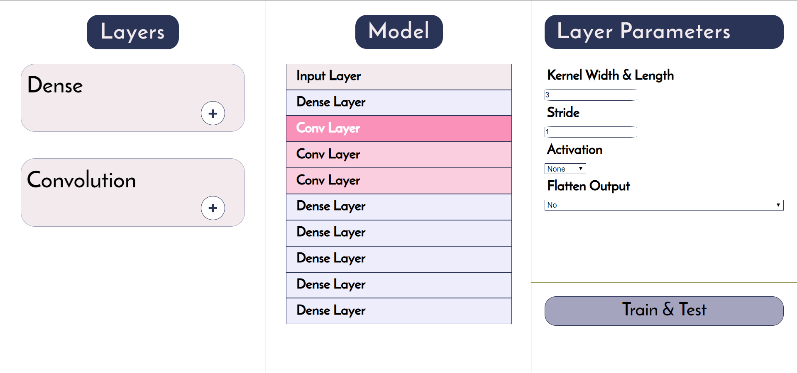

# Block AI
A personal project to simplify sequential neural network development.

### The Concept
The GUI gives the user three different columns
1. A selection of the types of layers that can be added.
2. A visual depiction of the layers in the current model
3. A editor where the layers and hyper-parameters can be fine tuned and the model finally trained.

Once the user is done adding dense or convolutional layers to their model, they can simply hit "Train & Test" and their model will be sent off to be trained with the MNIST dataset.

### The Development
The user interface was built using React JS. To communicate with the backend, a post request sends a JSON object containing the model structure to a Flask API, 
which parses the JSON and converts it into a Tensorflow Keras model. Then the 
chosen settings are applied to the training phase and the resulting accuracy
is returned to the browser.

